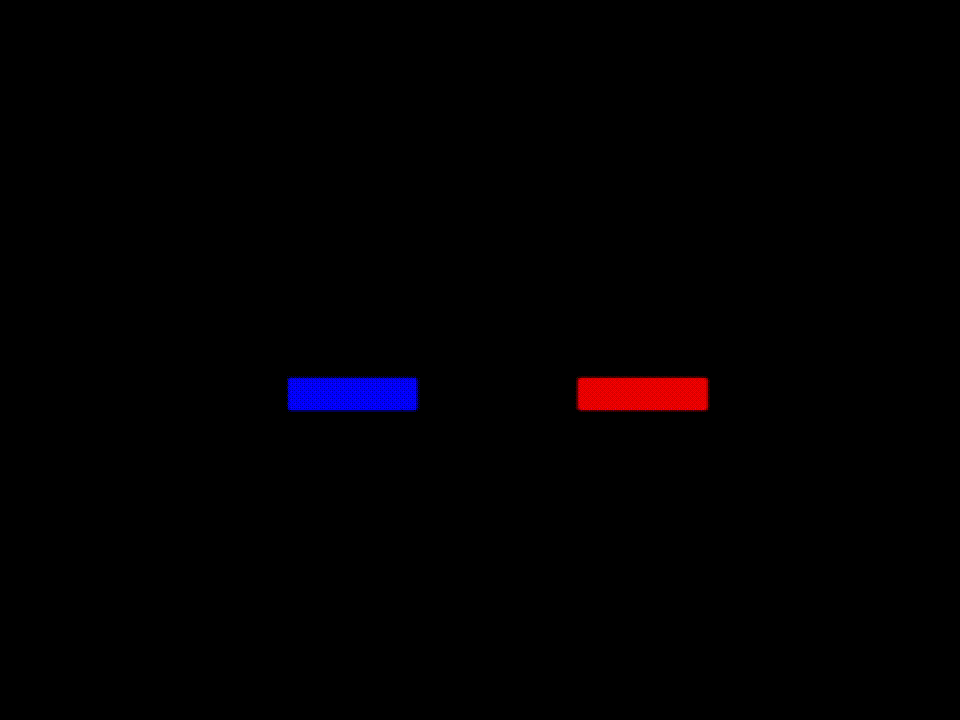

# tron-ai

A reinforcement learning-powered Tron game in Python, featuring AI agents and human/bot play. The project uses PyTorch, Gymnasium, and Pygame for game logic, training, and visualization.



## Features

- **Tron Game Engine:** Classic grid-based Tron gameplay with two players.
- **AI Agents:** Deep Q-Network (DQN) agents for self-play and training.
- **Human/Bot Play:** Play as a human or bot against AI.
- **Training & Evaluation:** Train agents and visualize performance with reward/step plots.
- **Model Management:** Save/load trained models (`*.pth` files).

## File Overview

- `game_board.py`: Game board logic and rendering.
- `player.py`: Player class, movement, and interaction.
- `player_bot.py`: Simple bot for human/bot control.
- `rl_ai.py`: DQN agent and RL logic.
- `run_game.py`: Main entry for running games (AI vs AI, human vs AI, etc.).
- `train.py`: Training loop for RL agents, generates plots.
- `requirements.txt`: Python dependencies.
- `*.pth`: Saved model weights.
- `README.md`: Project documentation.
- `tron_clip.gif`: Gameplay demo.
- `rewards_plot.png`, `steps_plot.png`: Training visualizations.

## Installation

1. **Clone the repository:**
	```bash
	git clone <repo-url>
	cd tron-ai
	```

2. **Install dependencies:**
	```bash
	pip install -r requirements.txt
	```

## Usage

### Run a Game

To play or watch AI agents:
```bash
python run_game.py
```
- By default, runs a game with two agents. Modify `run_game.py` to select human, bot, or AI players and load models.

### Train Agents

To train RL agents from scratch:
```bash
python train.py
```
- Training progress is saved as plots (`rewards_plot.png`, `steps_plot.png`).
- Model weights are saved as `.pth` files.

## Customization

- **AI Models:** Place your trained models in the root directory and specify their filenames in `run_game.py`.
- **Game Parameters:** Adjust grid size, episode count, and agent settings in `train.py` and `run_game.py`.

## Requirements

- Python 3.10+
- See `requirements.txt` for all dependencies (PyTorch, Gymnasium, Pygame, Matplotlib, etc.).

## Visualizations

- `tron_clip.gif`: Example gameplay.
- `rewards_plot.png`, `steps_plot.png`: Training metrics.

